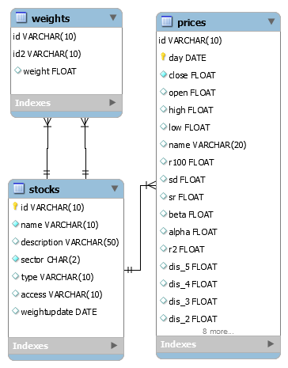
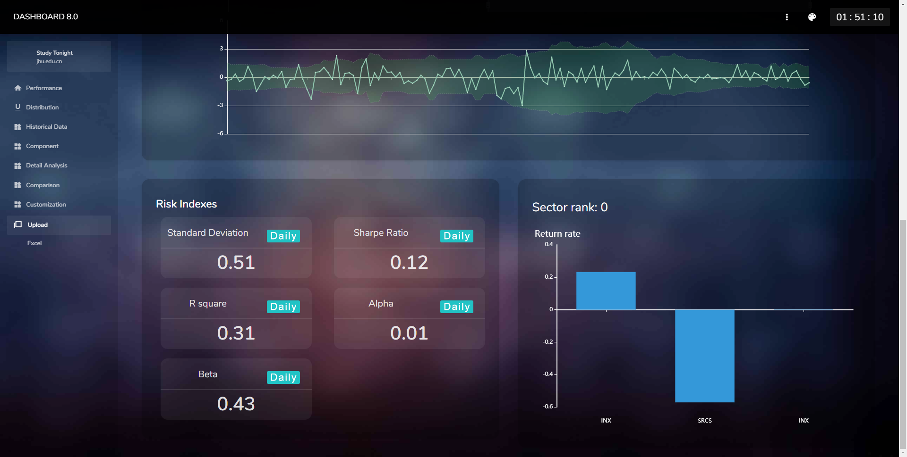
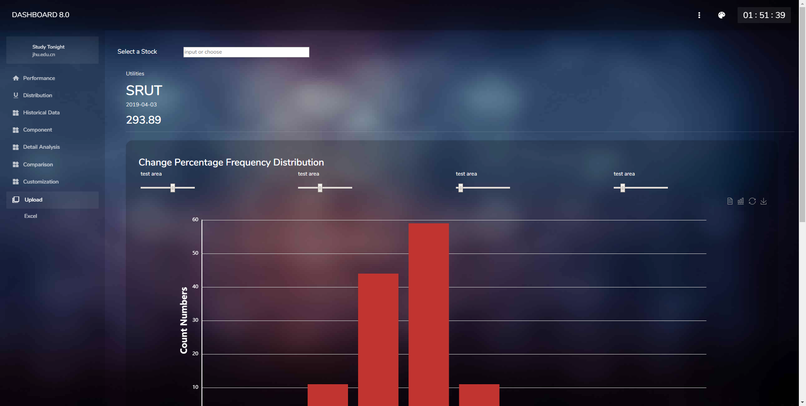
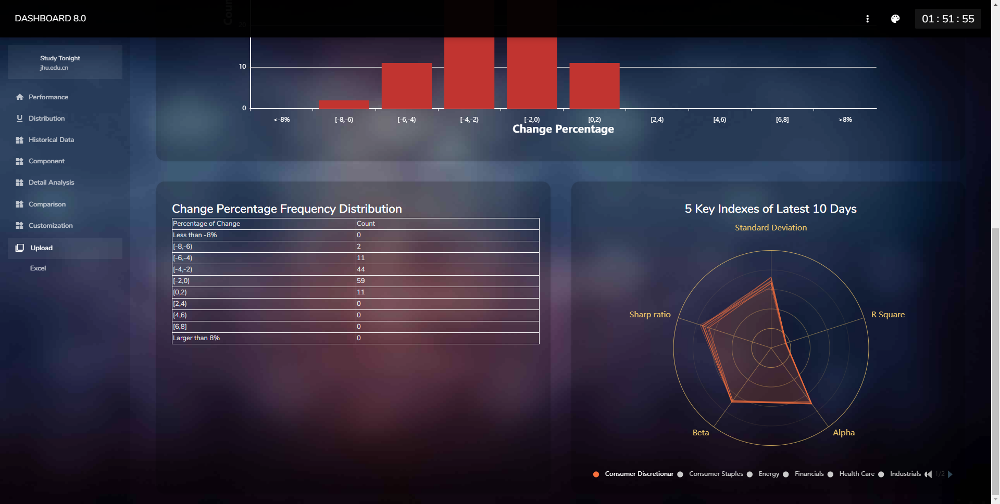
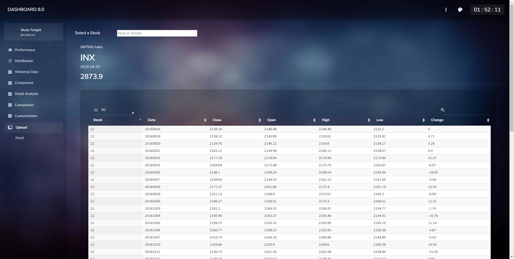
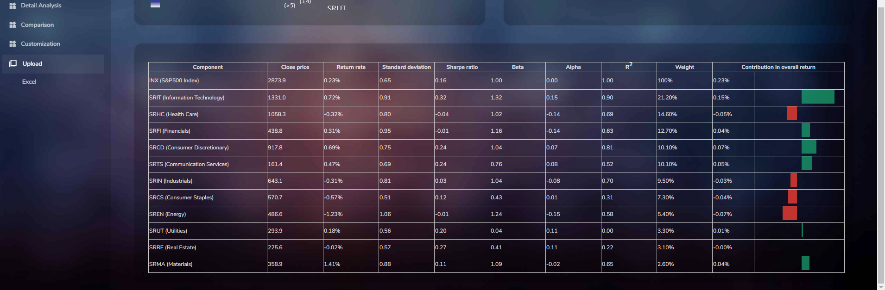
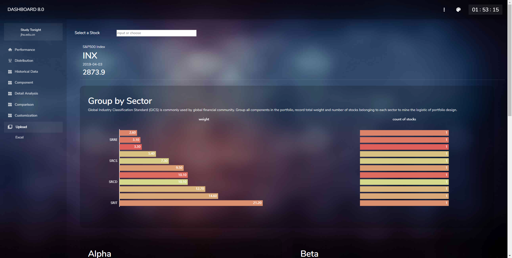
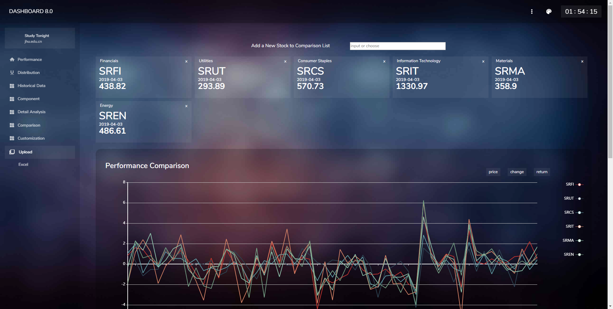
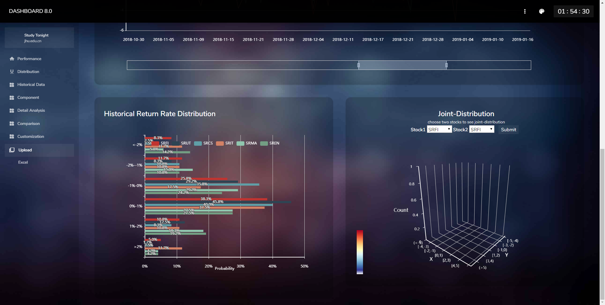

# mini-web-site-for-portfolio-and-stock
*For risk data visualizing and analyzing*  
  

  
This repository includes a website designed in purpose for providing a dashboard for financial assets including stocks and portfolios. It interprets the large amount of complicated data in a financial risk-performance manner and visualizes them into multiple types of diagram for easy analysis. By allowing new data added manually using sql script or automatically using the function in customize page to the database, it continuously gives valuable insights of how certain assets should be evaluated and ranked statistically. Financial companies, professional analysts and individual investors are targeting users of this website.
  

## Getting started

### Usage
The website can perform successfully through popular web browsers, Chrome, Firefox, Safari, etc. without installation after publishing. On mobile devices is also supported. For more stable usage, Chrome is recommended on mobile side.
 

### Testing data
The website is developed based on MySQL, sample data format can be seen in [sql folder](sql).   It currently has data of two-year prices of S&P500 index and its GICS Sector indexes, which is also the testing data of the project. The data is downloaded from .  
 
For each stock or portfolio, short code is demanded, other basic description including name, industry classification (stored in `stocks` table), portfolio component weight (stored in `weights` table) can be added as needed. Besides foundation information, daily close price is required for all dataset, adding other price variables (open, highest, lowest price) into `prices` table will bring a better view for the website dashboard. Other variables in `prices` table are filled with the calculation of the system. Further instructions are shown in [initiation section]( ### Installation).  
  
Change of SQL platform may result to invalid SQL data format or failure of query functions on the website.
  
### Installation
- **Environment and resources**  
  - Environment: Java EE  
  - SQL: MySQL  
  - Data resource: [barchart.com](https://www.barchart.com/)  
  - Theme template: [Envato](https://themeforest.net/)  
  - Diagram template: [Echarts](https://www.echartsjs.com/zh/index.html)  
  - External libraries: seen in [libs_extend folder](/libs_extend/)  
    commons-io-1.4.jar  
    fastjson-1.2.54.jar  
    javaee-api-7.0.jar  
    javax.servlet-api-4.0.1.jar  
    mysql-connector-java-8.0.15.zip  
  - Other: jQuery, JavaScript, CSS, JSON knowledge is needed for webpage coding, as well.

- **Setup and initiation**
  - Import the main application in `DASHBOARD8` folder  
  - Import libraries in `lib_extend` folder  
  - Import SQL data in `sql` folder and complete database account properties setting in `db.properties` in [DASHBOARD8/src](/DASHBOARD8/src/)  
     
  - Overview  
    This project uses Ajax method to communicate frontend and backend of the website.  
    Data is transfered in JSON format.  
    
  

## Features

### Performance page

### Distribution page

### Historical Data page

### Component page

### Detail Analysis page

### Comparation page

### Customization page

## Documentation

A detailed user manual, explaining usage instructions and analysis methods is uploaded in Dashboard8 folder, [manual.pdf](/DASHBOARD8/WebContent/manual.pdf). This documentation can also be reached through `User Manual` button in dropdown list in the webpage sidebar.  
  

## Contributors

This is a group project for a course.   
