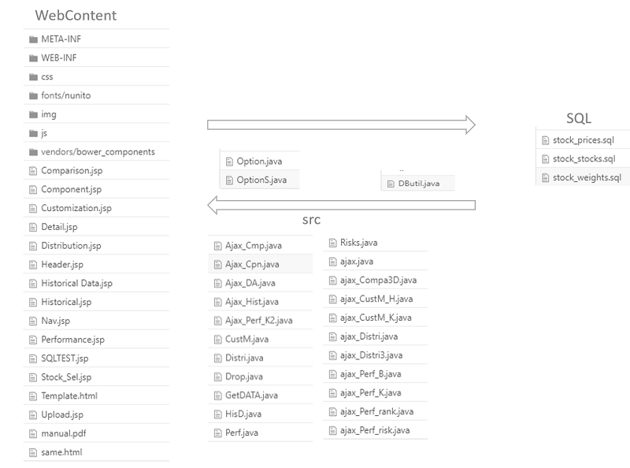
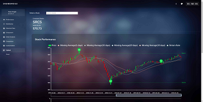
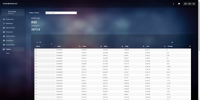
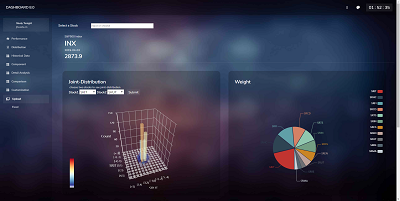
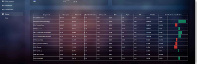
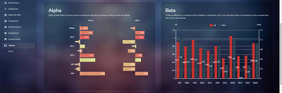
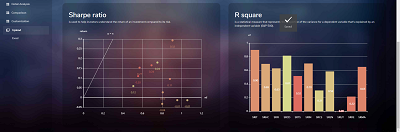
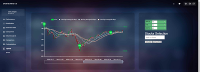
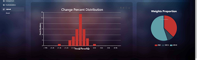

# mini-web-site-for-portfolio-and-stock
*For risk data visualizing and analyzing*  
  

  
This repository includes a website designed in purpose for providing a dashboard for financial assets including stocks and portfolios. It interprets the large amount of complicated data in a financial risk-performance manner and visualizes them into multiple types of diagram for easy analysis. By allowing new data added manually using sql script or automatically using the function in customize page to the database, it continuously gives valuable insights of how certain assets should be evaluated and ranked statistically. Financial companies, professional analysts and individual investors are targeting users of this website.
  

## Getting started

### Usage
The website can perform successfully through popular web browsers, Chrome, Firefox, Safari, etc. without installation after publishing. On mobile devices is also supported. For more stable usage, Chrome is recommended on mobile side.
 

### Testing data
The website is developed based on MySQL, sample data format can be seen in [sql folder](sql).   It currently has data of two-year prices of S&P500 index and its GICS Sector indexes, which is also the testing data of the project. The data is downloaded from [barchart.com](https://www.barchart.com/).  
  
Change of SQL platform may result to invalid SQL data format or failure of query functions on the website.
  
### Installation
- **Environment and resources**  
  - Environment: Java EE  
  - SQL: MySQL  
  - Data resource: [barchart.com](https://www.barchart.com/)  
  - Theme template: [Envato](https://themeforest.net/)  
  - Diagram template: [Echarts](https://www.echartsjs.com/zh/index.html)  
  - External libraries: seen in [libs_extend folder](/libs_extend/)  
    commons-io-1.4.jar  
    fastjson-1.2.54.jar  
    javaee-api-7.0.jar  
    javax.servlet-api-4.0.1.jar  
    mysql-connector-java-8.0.15.zip  
  - Other: jQuery, JavaScript, CSS, JSON knowledge is needed for webpage coding, as well.

- **Setup and initiation**
  - Import the main application in `DASHBOARD8` folder and unzip `other_setting_files.zip`. 
  - Import libraries in `lib_extend` folder  
  - Import SQL data in `sql` folder and complete database account properties setting in `db.properties` in [DASHBOARD8/src](/DASHBOARD8/src/)  
     
  - Architecture Overview  
      
    This project deploys the architecture separating front- and backend on the website. Ajax is used to communicate the two sides. Data is transfered in JSON format.  
    In `/DASHBOARD8/WebContent` folder, the files contain jsp and html scripts as well as their relavent css and js setting files used for frontend operation.
    `/DASHBOARD8/src` folder includes files responsible for backend development. To be more specific, `dbutil` builds the package for database connection; `option` records the classes initiated for the information and price indexes of risk data; and `SQL` takes charge of specific functions used for transferring data to each webpage.   
  

## Features

The website focus on assessing the performance of risk financial data, including stocks and portfolios. To deliver better visualization and analysis, the main features are grouped into six categories (respectively in each webpage) for different needs of users.  
  

### Performance page
  
  
Performance page displays the information of a selected risk asset. Choose one stock or portfolio from top search bar to start.  
- **Stock performance**  
  Shows the daily price (close, open, highest, lowest price, and average prices in certain durations) in a K-chart. A daily change rate is displayed below using line-chart. The green area in the chart indicating a reliable zone of price change rate each day, which means prices outside the area can be regarded as an outlier.  
- **Risk index** 
  Provide five risk indexes, namely standard deviation, r square, beta, alpha, Sharpe ratio, of the chosen asset at the newest day in database in form of text boxes.
- **Sector rank**  
  A bar-chart demonstrating the return rate of the chosen stock or portfolio in comparison to its GICS sector's and S&P 500's return rate. The rank (in its belonging sector) of the return rate is also provided in plain text.  

### Distribution page
  
  
Distribution page mainly tells about the distribution of change rate of a selected risk asset. Choose one stock or portfolio from top search bar to start. 
- **Change rate distribution**  
  The frequency distribution of change percentage is plotted in a bar-chart. Four extra parameters, min and max change rate, bin-width, change over certain days, are given for customizing a new distribution analysis as the users' needs. Below the bar-chart, a table is presented listing the information of the distribution chart in default setting.
- **Key index**  
  A radar-chart displaying the five indexes as previously mentioned for the latest ten days of the asset.

### Historical data page
  
Historical data page lists the historical data of a selected risk asset in the database in the format of table. Choose one stock or portfolio from top search bar to start.  

### Component page
  
  
Component page is developed for portfolio analysis and gives an overview of a selected portfolio. Choose one portfolio from top search bar to start.  
- **Joint-distribution**  
  Choose any two of the components of the portfolio to display a joint-distribution of return rate in the form of 3D bar-chart.
- **Weights**  
  A pie-chart illustrating the weight (in terms of prices) of each component stocks of the portfolio.  
- **Detail table**  
  Detail information containing important factors, respectively current price, return rate, risk related indexes, the stock weight in this portfolio of each component is shown in forms of table and bar-chart.  

### Detail analysis page
  
  
  
Component page is developed for portfolio analysis and offers a deeper insight of risks and performance of a selected portfolio. Choose one portfolio from top search bar to start.  
Five analysis parts is given in different visualization methods. For each part, analysis is made in terms of GICS sectors. It reveals the health and potential of the components in different classes of sectors.
- **Weight and number of stocks included** (bar-chart)    
- **Alpha index and change rate** (bar-chart)  
- **Beta index and standard deviation** (bar-chart)  
- **Sharpe ratio and neutral line** (scatterplot and line-chart)
- **R square** (bar-chart)  

### Comparison page
  
  
Component page allows comparison of multiple assets. Choose stocks or portfolios from top search bar to add a comparison and delete any one by clicking its tag.  
- **Performance**  
  Shows the daily close price of all stocks and portfolios from the current comparison list in the format of line-chart. Change the close price to return rate or standardized close price by selecting at the top of the chart.  
- **Change rate distribution**  
  A bar-chart displaying the frequency distribution of change rate of all chosen stocks and portfolios in the comparison list.  
- **Joint-distribution**  
  Choose any two stocks or portfolios from the current comparison list to display a joint-distribution of return rate in the form of 3D bar-chart.  

### Customization page
  
  
Component page helps define a new portfolio by grouping multiple assets. Choose stocks or portfolios from top search bar to add a component and delete any one by clicking its tag.  
- **Performance**  
   Shows the daily price (close, open, highest, lowest price, and average prices in certain durations) of currently designed portfolio in K-chart.  
- **Change rate distribution**  
  The frequency distribution of the portfolio of change percentage is plotted in a bar-chart.  
- **Weights**  
  A pie-chart illustrating the weight (in terms of prices) of each component stocks of this portfolio.  

## Documentation

A detailed user manual, explaining usage instructions and analysis methods is uploaded in Dashboard8 folder, [manual.pdf](/DASHBOARD8/WebContent/manual.pdf). This documentation can also be reached through `User Manual` button in dropdown list in the webpage sidebar.  
  

## Contribution

This is a group project for a course. My teammate Andi, Sean and I worked together to accomplish this work.  
